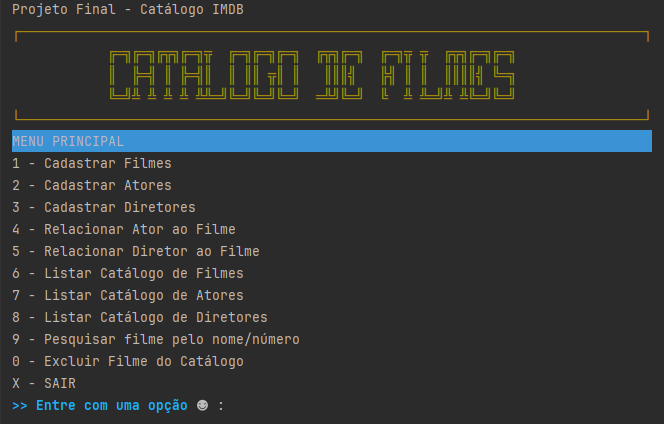

### Ser + Tech Programa 50+
## Projeto Final - Catálogo IMDB

Enunciado Do Projeto:

```
# Deadline : 22/dezembro/2023
Desenvolva um sistema que apresente um catálogo de filmes, similar ao IMDB.

Neste sistema cada filme deve possuir alguns atributos como o nome, 
data de lançamento, orçamento e descrição.

Cada filme também deve possuir um diretor e uma lista de atores que trabalharam 
no filme, adicione atributos para as pessoas. Implemente uma aplicação em que 
o usuário possa:
 - cadastrar filmes;
 - cadastrar atores;
 - cadastrar diretores;
 - associar um filme com seus atores e diretores;
 - permita pesquisar filme cadastrados pelo nome, desconsiderando 
   letras maiúsculas e minúsculas

Utilize os conceitos de programação orientada a objetos vistos nas aulas como 
encapsulamento, herança, polimorfismos e classes abstratas.
```

Tecnologia:
* Java 17
* Idea Intelij Community

Classes:
* **ConsoleColors**: Contém os *ANSI Colors Java*, 
que permitem alterar as cores do texto na console do Java.

  * Créditos: https://www.w3schools.blog/ansi-colors-java

* **Menu**: Contém os métodos responsáveis pela interação 
do Usuário com as diversas opções do Menu  

* **TestesCatalogo**: Classe Main do projeto
* **CatalogoService**: Métodos diversos para manipulação dos dados
<br>
## Tela do Menu Principal:
